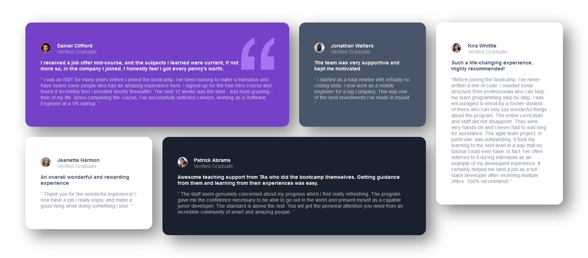

# Frontend Mentor - Stats preview card component solution

This is a solution to the [Testimonials grid section challenge on Frontend Mentor](https://www.frontendmentor.io/challenges/testimonials-grid-section-Nnw6J7Un7). Frontend Mentor challenges help you improve your coding skills by building realistic projects.

## Table of contents

- [Overview](#overview)
  - [The challenge](#the-challenge)
  - [Screenshot](#screenshot)
  - [Links](#links)
- [My process](#my-process)
  - [Built with](#built-with)
- [Author](#author)
- [Acknowledgments](#acknowledgments)

## Overview

### The challenge

Users should be able to:

- View the optimal layout depending on their device's screen size

### Screenshot

### Links

- [Live Site](https://jgeev.github.io/testimonials-grid-section-main/)

## My process

### Built with

- HTML and CSS

## Author

- Github - [jgeev](https://github.com/jgeev)
- Frontend Mentor - [@jgeev](https://www.frontendmentor.io/profile/jgeev)

## Acknowledgments

Thank you Frontend Mentor for the challenge
